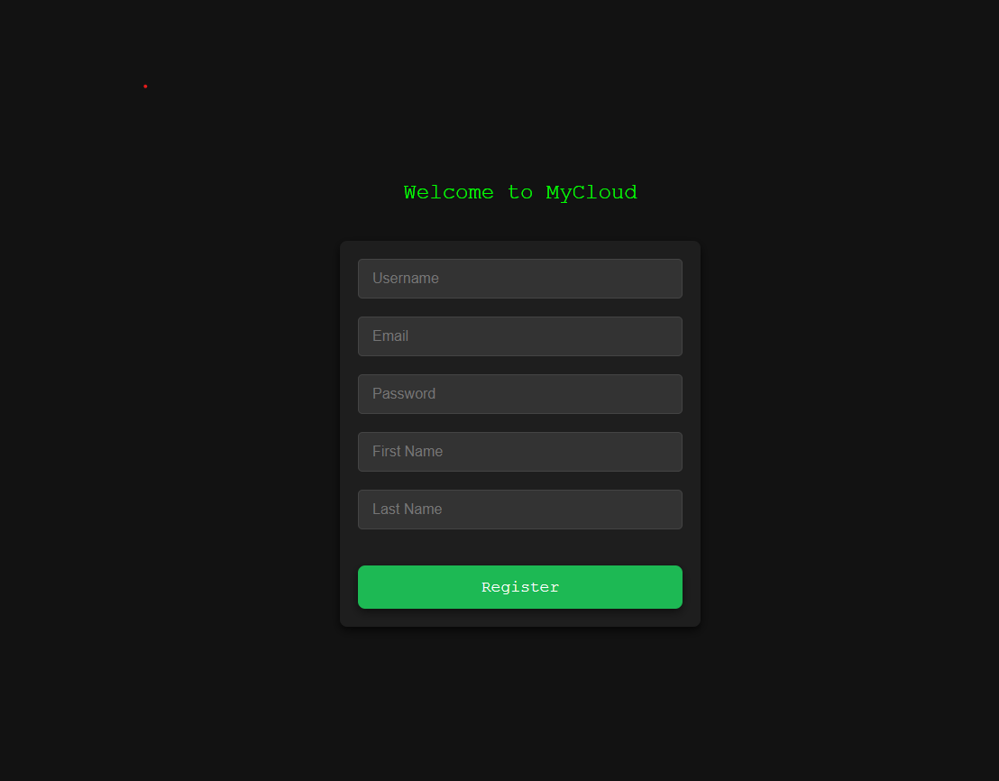
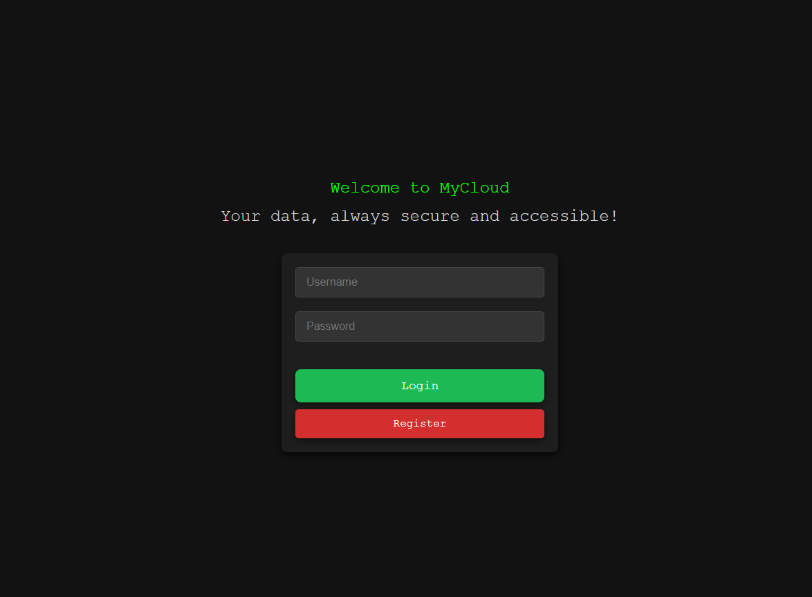
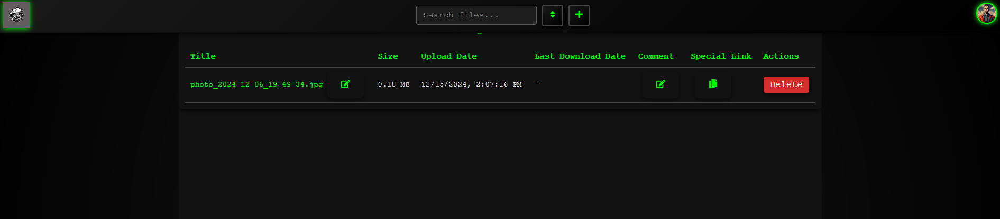

# MyCloud Project - Django & React + Vite

Welcome to the **MyCloud** project repository! This is a graduation project built with **Django** for the backend and **React** with **Vite** for the frontend. It provides cloud-like storage functionality, allowing users to securely manage and store files.

### Project Structure

- **`backend/`**: Contains the Django backend for handling user authentication, file management, and more.
- **`frontend/`**: Contains the React app bundled with Vite, which is used for the user interface.
- **`pics/`**: Contains example images for various functionalities:

### Frontend Setup

The frontend is built using **React** and **Vite**. For detailed instructions on how to set up the frontend, please follow the link below:

[Frontend Setup](frontend)

### Backend Setup

The backend is developed using **Django**. You can find the setup instructions for the backend in the following link:

[Backend Setup](backend)

### Example Screenshots

Below are some screenshots to guide you through the main functionalities of the app: 
- **Registration**: 
- **Login**: 
- **Main Pge**: 
- **File Uploading**: 

### Current Setup

The project is currently configured for **local deployment**. However, the README includes detailed instructions on how to configure the project for deployment on a **[server](backend/README_Server.md)**.

---

## Ru

Добро пожаловать в репозиторий проекта **MyCloud**! Это дипломный проект, построенный с использованием **Django** для бэкенда и **React** с **Vite** для фронтенда. Проект предоставляет функционал облачного хранилища, позволяя пользователям безопасно управлять и хранить файлы.

### Структура проекта

- **`backend/`**: Содержит бэкенд на Django для обработки аутентификации пользователей, управления файлами и других функций.
- **`frontend/`**: Содержит приложение на React, собранное с помощью Vite, для пользовательского интерфейса.

### Настройка фронтенда

Фронтенд разработан с использованием **React** и **Vite**. Подробные инструкции по настройке фронтенда можно найти по следующей ссылке:

[Настройка фронтенда](frontend)

### Настройка бэкенда

Бэкенд разработан с использованием **Django**. Инструкции по настройке бэкенда можно найти по следующей ссылке:

[Настройка бэкенда](backend)

### Примеры скриншотов

Ниже приведены скриншоты, которые помогут вам понять основные функции приложения:
- **Регистрация**: 
- **Авторизация**:  
- **Главная Страница**: 
- **Загрузка файлов**: 

### Текущая настройка

Проект в настоящее время настроен для **локальной разработки**. Однако README включает подробные инструкции по настройке проекта для развертывания на **[сервере](backend/README_Server.md)**.